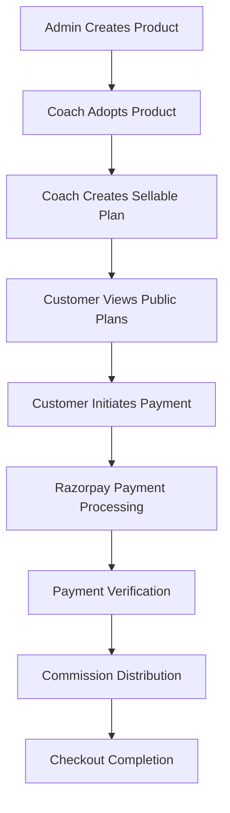

# Payment System V1 - Complete Testing Guide

## Overview

This guide provides step-by-step instructions for testing the Payment System V1, including admin product creation, coach plan adoption, payment processing, and end-to-end workflows.

## Prerequisites

### 1. Environment Setup
Ensure you have the following environment variables configured:
```bash
RAZORPAY_KEY_ID=rzp_test_xxxxxxxxxxxxx
RAZORPAY_KEY_SECRET=xxxxxxxxxxxxxxxxxxxx
RAZORPAY_WEBHOOK_SECRET=xxxxxxxxxxxxxxxxxxxx
FRONTEND_URL=http://localhost:3000
```

### 2. Required Tools
- **Postman** or **Insomnia** for API testing
- **Browser** for checkout page testing
- **MongoDB Compass** or similar for database inspection
- **Razorpay Dashboard** for payment monitoring

### 3. Test Data Preparation
- Admin user account with valid token
- Coach user account with valid token
- Test customer information

## Testing Workflow Overview



## Phase 1: Admin Product Management Testing

### Test 1.1: Create Admin Product

**Objective**: Test admin product creation with various configurations

**Steps**:
1. **Prepare Test Data**:
```json
{
  "name": "Premium Fitness Transformation Program",
  "description": "A comprehensive 12-week fitness program designed for complete body transformation. Includes workout plans, nutrition guides, and progress tracking.",
  "shortDescription": "Complete fitness transformation in 12 weeks",
  "category": "fitness_training",
  "productType": "digital",
  "basePrice": 2999,
  "currency": "INR",
  "pricingRules": {
    "allowCustomPricing": true,
    "minPrice": 1999,
    "maxPrice": 4999,
    "suggestedMarkup": 20
  },
  "features": [
    {
      "title": "12-Week Structured Program",
      "description": "Progressive workout plans for all fitness levels",
      "icon": "calendar"
    },
    {
      "title": "Nutrition Guidance",
      "description": "Complete meal plans and recipes",
      "icon": "food"
    },
    {
      "title": "Video Demonstrations",
      "description": "HD video tutorials for all exercises",
      "icon": "play"
    },
    {
      "title": "Progress Tracking",
      "description": "Built-in tools to track your transformation",
      "icon": "chart"
    }
  ],
  "contentFiles": [
    {
      "fileName": "workout-plan.pdf",
      "fileUrl": "/uploads/workout-plan.pdf",
      "fileSize": 2048000,
      "fileType": "application/pdf",
      "isDownloadable": true
    },
    {
      "fileName": "nutrition-guide.pdf",
      "fileUrl": "/uploads/nutrition-guide.pdf",
      "fileSize": 1536000,
      "fileType": "application/pdf",
      "isDownloadable": true
    }
  ],
  "videoContent": [
    {
      "title": "Program Introduction",
      "videoUrl": "/uploads/intro-video.mp4",
      "duration": 300,
      "thumbnail": "/uploads/intro-thumbnail.jpg"
    },
    {
      "title": "Workout Demonstration",
      "videoUrl": "/uploads/workout-demo.mp4",
      "duration": 600,
      "thumbnail": "/uploads/workout-thumbnail.jpg"
    }
  ],
  "termsAndConditions": "By purchasing this program, you agree to follow the workout plans safely and consult a healthcare provider if needed. No refunds after 7 days of purchase.",
  "refundPolicy": "Full refund available within 7 days of purchase. Contact support for refund requests.",
  "commissionSettings": {
    "platformCommissionPercentage": 10,
    "coachCommissionPercentage": 80
  }
}
```

2. **API Call**:
```http
POST /api/paymentsv1/admin/products
Authorization: Bearer <admin-token>
Content-Type: application/json

[Use the JSON data above]
```

3. **Expected Response**:
```json
{
  "success": true,
  "message": "Admin product created successfully",
  "data": {
    "productId": "ADMIN_PROD_1234567890_abc123def",
    "name": "Premium Fitness Transformation Program",
    "status": "draft",
    "isAvailableForCoaches": true,
    "createdAt": "2024-01-15T10:30:00.000Z"
  }
}
```

4. **Verification**:
   - Check database for new product record
   - Verify productId is unique
   - Confirm status is "draft"
   - Validate all fields are saved correctly

### Test 1.2: Update Product Status to Active

**Steps**:
1. **API Call**:
```http
PUT /api/paymentsv1/admin/products/{productId}/status
Authorization: Bearer <admin-token>
Content-Type: application/json

{
  "status": "active"
}
```

2. **Expected Response**:
```json
{
  "success": true,
  "message": "Product status updated successfully",
  "data": {
    "productId": "ADMIN_PROD_1234567890_abc123def",
    "status": "active",
    "publishedAt": "2024-01-15T10:35:00.000Z"
  }
}
```

### Test 1.3: Get Products Available for Coaches

**Steps**:
1. **API Call**:
```http
GET /api/paymentsv1/admin/products/available-for-coaches
Authorization: Bearer <admin-token>
```

2. **Expected Response**:
```json
{
  "success": true,
  "data": [
    {
      "productId": "ADMIN_PROD_1234567890_abc123def",
      "name": "Premium Fitness Transformation Program",
      "description": "A comprehensive 12-week fitness program...",
      "category": "fitness_training",
      "productType": "digital",
      "basePrice": 2999,
      "currency": "INR",
      "pricingRules": {
        "allowCustomPricing": true,
        "minPrice": 1999,
        "maxPrice": 4999,
        "suggestedMarkup": 20
      },
      "features": [...],
      "coverImage": null
    }
  ]
}
```

## Phase 2: Coach Plan Management Testing

### Test 2.1: Coach Adopts Admin Product

**Objective**: Test coach's ability to create a sellable plan from an admin product

**Steps**:
1. **Prepare Coach Plan Data**:
```json
{
  "adminProductId": "ADMIN_PROD_1234567890_abc123def",
  "title": "Elite Fitness Transformation with Personal Coaching",
  "description": "Transform your body with my personalized approach to fitness. This premium program includes everything from the base program plus exclusive personal coaching sessions and custom meal plans tailored to your specific goals.",
  "shortDescription": "Premium fitness program with personal coaching",
  "price": 3999,
  "additionalFeatures": [
    {
      "title": "Weekly Personal Coaching Calls",
      "description": "30-minute one-on-one coaching sessions every week",
      "icon": "phone"
    },
    {
      "title": "Custom Meal Plans",
      "description": "Personalized nutrition plans based on your goals and preferences",
      "icon": "food"
    },
    {
      "title": "24/7 WhatsApp Support",
      "description": "Direct access to me via WhatsApp for questions and motivation",
      "icon": "message"
    },
    {
      "title": "Progress Photo Reviews",
      "description": "Weekly photo reviews with detailed feedback and adjustments",
      "icon": "camera"
    }
  ],
  "additionalContentFiles": [
    {
      "fileName": "bonus-workouts.pdf",
      "fileUrl": "/uploads/bonus-workouts.pdf",
      "fileSize": 1024000,
      "fileType": "application/pdf",
      "isDownloadable": true
    },
    {
      "fileName": "meal-prep-guide.pdf",
      "fileUrl": "/uploads/meal-prep-guide.pdf",
      "fileSize": 800000,
      "fileType": "application/pdf",
      "isDownloadable": true
    }
  ],
  "additionalVideoContent": [
    {
      "title": "Personal Coaching Introduction",
      "videoUrl": "/uploads/coaching-intro.mp4",
      "duration": 180,
      "thumbnail": "/uploads/coaching-thumbnail.jpg"
    }
  ],
  "customTermsAndConditions": "This premium program includes personal coaching sessions. All sessions must be scheduled at least 24 hours in advance. 30-day money-back guarantee applies.",
  "customRefundPolicy": "Full refund available within 30 days of purchase. Personal coaching sessions already conducted will be deducted from refund amount."
}
```

2. **API Call**:
```http
POST /api/paymentsv1/coach/plans
Authorization: Bearer <coach-token>
Content-Type: application/json

[Use the JSON data above]
```

3. **Expected Response**:
```json
{
  "success": true,
  "message": "Coach sellable plan created successfully",
  "data": {
    "planId": "COACH_PLAN_1234567890_def456ghi",
    "title": "Elite Fitness Transformation with Personal Coaching",
    "price": 3999,
    "currency": "INR",
    "status": "draft",
    "isPublic": false,
    "createdAt": "2024-01-15T11:00:00.000Z"
  }
}
```

### Test 2.2: Update Plan Status to Active

**Steps**:
1. **API Call**:
```http
PUT /api/paymentsv1/coach/plans/{planId}/status
Authorization: Bearer <coach-token>
Content-Type: application/json

{
  "status": "active"
}
```

2. **Expected Response**:
```json
{
  "success": true,
  "message": "Plan status updated successfully",
  "data": {
    "planId": "COACH_PLAN_1234567890_def456ghi",
    "status": "active",
    "isPublic": false,
    "publishedAt": "2024-01-15T11:05:00.000Z"
  }
}
```

### Test 2.3: Make Plan Public

**Steps**:
1. **API Call**:
```http
PUT /api/paymentsv1/coach/plans/{planId}
Authorization: Bearer <coach-token>
Content-Type: application/json

{
  "isPublic": true
}
```

2. **Verification**: Check that plan is now visible in public plans endpoint

## Phase 3: Public Plan Access Testing

### Test 3.1: Get Public Plans

**Steps**:
1. **API Call**:
```http
GET /api/paymentsv1/public/plans?page=1&limit=20&category=fitness_training
```

2. **Expected Response**:
```json
{
  "success": true,
  "data": [
    {
      "planId": "COACH_PLAN_1234567890_def456ghi",
      "title": "Elite Fitness Transformation with Personal Coaching",
      "description": "Transform your body with my personalized approach...",
      "price": 3999,
      "currency": "INR",
      "coachId": {
        "_id": "coach_123",
        "name": "John Fitness Coach",
        "email": "john@fitnesscoach.com",
        "profilePicture": "/uploads/john-profile.jpg"
      },
      "adminProductId": {
        "_id": "product_123",
        "name": "Premium Fitness Transformation Program",
        "category": "fitness_training",
        "productType": "digital"
      }
    }
  ],
  "pagination": {
    "currentPage": 1,
    "totalPages": 1,
    "totalPlans": 1,
    "hasNextPage": false,
    "hasPrevPage": false
  }
}
```

### Test 3.2: Get Plan Details for Purchase

**Steps**:
1. **API Call**:
```http
GET /api/paymentsv1/public/plans/{planId}/details
```

2. **Expected Response**:
```json
{
  "success": true,
  "data": {
    "planId": "COACH_PLAN_1234567890_def456ghi",
    "title": "Elite Fitness Transformation with Personal Coaching",
    "description": "Transform your body with my personalized approach...",
    "price": 3999,
    "currency": "INR",
    "coachId": {
      "_id": "coach_123",
      "name": "John Fitness Coach",
      "email": "john@fitnesscoach.com"
    },
    "adminProductId": {
      "_id": "product_123",
      "name": "Premium Fitness Transformation Program",
      "features": [...],
      "contentFiles": [...],
      "videoContent": [...]
    }
  }
}
```

3. **Verification**: Check that view count increased by 1

## Phase 4: Checkout Page Testing

### Test 4.1: Get Checkout Data

**Steps**:
1. **API Call**:
```http
GET /api/paymentsv1/checkout/coach-plan/{planId}?customerId=customer_123&customerEmail=customer@example.com&customerPhone=+919876543210
```

2. **Expected Response**:
```json
{
  "success": true,
  "data": {
    "plan": {
      "planId": "COACH_PLAN_1234567890_def456ghi",
      "title": "Elite Fitness Transformation with Personal Coaching",
      "description": "Transform your body with my personalized approach...",
      "price": 3999,
      "currency": "INR",
      "features": [
        // Combined features from admin product + coach additions
      ],
      "contentFiles": [
        // Combined content files
      ],
      "videoContent": [
        // Combined video content
      ]
    },
    "coach": {
      "coachId": "coach_123",
      "name": "John Fitness Coach",
      "email": "john@fitnesscoach.com",
      "profilePicture": "/uploads/john-profile.jpg"
    },
    "product": {
      "productId": "product_123",
      "name": "Premium Fitness Transformation Program",
      "category": "fitness_training",
      "productType": "digital"
    },
    "pricing": {
      "basePrice": 2999,
      "coachPrice": 3999,
      "currency": "INR",
      "savings": 0
    },
    "terms": {
      "termsAndConditions": "This premium program includes personal coaching sessions...",
      "refundPolicy": "Full refund available within 30 days of purchase..."
    },
    "customer": {
      "customerId": "customer_123",
      "customerEmail": "customer@example.com",
      "customerPhone": "+919876543210"
    },
    "razorpay": {
      "keyId": "rzp_test_xxxxxxxxxxxxx",
      "currency": "INR"
    }
  }
}
```

### Test 4.2: Test Checkout Page UI

**Steps**:
1. **Open Browser**: Navigate to `http://localhost:8080/checkout.html?planId=COACH_PLAN_1234567890_def456ghi`
2. **Verify Page Loads**: Check that all plan details are displayed correctly
3. **Test Form Validation**: Try submitting empty form to verify validation
4. **Fill Form**: Enter test customer details
5. **Verify Razorpay Integration**: Check that Razorpay key is loaded correctly

## Phase 5: Payment Processing Testing

### Test 5.1: Create Payment Order

**Steps**:
1. **API Call**:
```http
POST /api/paymentsv1/payments/coach-plan/create-order
Content-Type: application/json

{
  "planId": "COACH_PLAN_1234567890_def456ghi",
  "customerId": "customer_123",
  "customerEmail": "customer@example.com",
  "customerPhone": "+919876543210"
}
```

2. **Expected Response**:
```json
{
  "success": true,
  "message": "Order created successfully",
  "data": {
    "orderId": "order_1234567890",
    "amount": 399900,
    "currency": "INR",
    "key": "rzp_test_xxxxxxxxxxxxx",
    "plan": {
      "planId": "COACH_PLAN_1234567890_def456ghi",
      "title": "Elite Fitness Transformation with Personal Coaching",
      "price": 3999,
      "currency": "INR",
      "coach": {
        "name": "John Fitness Coach",
        "email": "john@fitnesscoach.com"
      }
    }
  }
}
```

3. **Verification**:
   - Check Razorpay dashboard for new order
   - Verify order amount is in paise (399900)
   - Confirm order notes contain plan and customer details

### Test 5.2: Test Payment Flow (Using Razorpay Test Cards)

**Steps**:
1. **Use Test Card**: `4111 1111 1111 1111`
2. **CVV**: Any 3 digits
3. **Expiry**: Any future date
4. **Name**: Any name
5. **Complete Payment**: Follow Razorpay flow
6. **Verify Payment**: Check that payment is captured successfully

### Test 5.3: Verify Payment

**Steps**:
1. **API Call** (after successful payment):
```http
POST /api/paymentsv1/payments/verify
Content-Type: application/json

{
  "razorpay_order_id": "order_1234567890",
  "razorpay_payment_id": "pay_1234567890",
  "razorpay_signature": "signature_1234567890"
}
```

2. **Expected Response**:
```json
{
  "success": true,
  "message": "Payment verified successfully",
  "data": {
    "paymentId": "pay_1234567890",
    "status": "captured",
    "amount": 3999,
    "currency": "INR"
  }
}
```

3. **Verification**:
   - Check database for updated payment record
   - Verify payment status is "captured"
   - Confirm commission calculations are correct

## Phase 6: Commission and Analytics Testing

### Test 6.1: Verify Commission Distribution

**Steps**:
1. **Check Coach Plan Stats**:
```http
GET /api/paymentsv1/coach/plans/stats
Authorization: Bearer <coach-token>
```

2. **Expected Response**:
```json
{
  "success": true,
  "data": {
    "totalPlans": 1,
    "activePlans": 1,
    "publicPlans": 1,
    "totalSales": 1,
    "totalRevenue": 3999,
    "totalViews": 2,
    "totalCommissionEarned": 3199.2,
    "totalPlatformCommissionPaid": 399.9
  }
}
```

3. **Verification**:
   - Commission earned = 3999 * 0.8 = 3199.2
   - Platform commission = 3999 * 0.1 = 399.9
   - Check individual plan stats

### Test 6.2: Check Admin Product Stats

**Steps**:
1. **API Call**:
```http
GET /api/paymentsv1/admin/products/{productId}/stats
Authorization: Bearer <admin-token>
```

2. **Expected Response**:
```json
{
  "success": true,
  "data": {
    "product": {
      "productId": "ADMIN_PROD_1234567890_abc123def",
      "name": "Premium Fitness Transformation Program",
      "totalSales": 1,
      "totalRevenue": 3999,
      "viewCount": 2
    },
    "coachPlans": {
      "total": 1,
      "active": 1,
      "totalSales": 1,
      "totalRevenue": 3999
    },
    "topCoaches": [
      {
        "coachId": "coach_123",
        "coachName": "John Fitness Coach",
        "planId": "COACH_PLAN_1234567890_def456ghi",
        "sales": 1,
        "revenue": 3999
      }
    ]
  }
}
```

## Phase 7: Checkout Completion Testing

### Test 7.1: Process Checkout Completion

**Steps**:
1. **API Call**:
```http
POST /api/paymentsv1/checkout/complete
Content-Type: application/json

{
  "orderId": "order_1234567890",
  "paymentId": "pay_1234567890",
  "signature": "signature_1234567890",
  "planId": "COACH_PLAN_1234567890_def456ghi",
  "customerId": "customer_123",
  "customerEmail": "customer@example.com",
  "customerPhone": "+919876543210",
  "businessType": "coach_plan_purchase"
}
```

2. **Expected Response**:
```json
{
  "success": true,
  "message": "Checkout completed successfully",
  "data": {
    "paymentId": "pay_1234567890",
    "orderId": "order_1234567890",
    "amount": 3999,
    "currency": "INR",
    "status": "captured",
    "businessType": "coach_plan_purchase",
    "plan": {
      "planId": "COACH_PLAN_1234567890_def456ghi",
      "title": "Elite Fitness Transformation with Personal Coaching",
      "coach": {
        "name": "John Fitness Coach",
        "email": "john@fitnesscoach.com"
      }
    },
    "access": {
      "contentFiles": [
        // All accessible content files
      ],
      "videoContent": [
        // All accessible video content
      ]
    }
  }
}
```

### Test 7.2: Get Payment History

**Steps**:
1. **API Call**:
```http
GET /api/paymentsv1/checkout/payment-history/customer_123?page=1&limit=20
Authorization: Bearer <customer-token>
```

2. **Expected Response**:
```json
{
  "success": true,
  "data": [
    {
      "paymentId": "pay_1234567890",
      "orderId": "order_1234567890",
      "amount": 3999,
      "currency": "INR",
      "status": "captured",
      "businessType": "coach_plan_purchase",
      "productName": "Elite Fitness Transformation with Personal Coaching",
      "productDescription": "Transform your body with my personalized approach...",
      "createdAt": "2024-01-15T12:00:00.000Z",
      "capturedAt": "2024-01-15T12:01:00.000Z",
      "coach": {
        "name": "John Fitness Coach",
        "email": "john@fitnesscoach.com"
      },
      "plan": {
        "title": "Elite Fitness Transformation with Personal Coaching",
        "price": 3999
      }
    }
  ],
  "pagination": {
    "currentPage": 1,
    "totalPages": 1,
    "totalPayments": 1,
    "hasNextPage": false,
    "hasPrevPage": false
  }
}
```

## Phase 8: Platform Subscription Testing

### Test 8.1: Create Subscription Order

**Steps**:
1. **API Call**:
```http
POST /api/paymentsv1/payments/subscription/create-order
Content-Type: application/json

{
  "coachId": "coach_123",
  "subscriptionPlan": "professional",
  "amount": 999,
  "billingCycle": "monthly",
  "customerEmail": "coach@example.com",
  "customerPhone": "+919876543210"
}
```

2. **Expected Response**:
```json
{
  "success": true,
  "message": "Subscription order created successfully",
  "data": {
    "orderId": "order_subscription_1234567890",
    "amount": 99900,
    "currency": "INR",
    "key": "rzp_test_xxxxxxxxxxxxx",
    "subscription": {
      "plan": "professional",
      "billingCycle": "monthly",
      "amount": 999,
      "coach": {
        "name": "John Fitness Coach",
        "email": "john@fitnesscoach.com"
      }
    }
  }
}
```

### Test 8.2: Get Subscription Checkout Data

**Steps**:
1. **API Call**:
```http
GET /api/paymentsv1/checkout/subscription?coachId=coach_123&subscriptionPlan=professional&billingCycle=monthly&amount=999
```

2. **Expected Response**:
```json
{
  "success": true,
  "data": {
    "subscription": {
      "plan": "professional",
      "billingCycle": "monthly",
      "amount": 999,
      "currency": "INR",
      "description": "monthly subscription for professional plan"
    },
    "coach": {
      "coachId": "coach_123",
      "name": "John Fitness Coach",
      "email": "john@fitnesscoach.com",
      "profilePicture": "/uploads/john-profile.jpg"
    },
    "features": [
      "Access to all coaching tools",
      "Up to 50 clients",
      "Advanced analytics",
      "Priority support",
      "Custom branding",
      "API access"
    ],
    "terms": {
      "termsAndConditions": "By subscribing to our platform, you agree to...",
      "refundPolicy": "Refund Policy: Monthly subscriptions: Refunds available within 7 days..."
    },
    "razorpay": {
      "keyId": "rzp_test_xxxxxxxxxxxxx",
      "currency": "INR"
    }
  }
}
```

## Phase 9: Error Handling Testing

### Test 9.1: Invalid Plan ID

**Steps**:
1. **API Call**:
```http
GET /api/paymentsv1/public/plans/invalid_plan_id/details
```

2. **Expected Response**:
```json
{
  "success": false,
  "message": "Plan not found or not available for purchase"
}
```

### Test 9.2: Invalid Payment Verification

**Steps**:
1. **API Call**:
```http
POST /api/paymentsv1/payments/verify
Content-Type: application/json

{
  "razorpay_order_id": "invalid_order",
  "razorpay_payment_id": "invalid_payment",
  "razorpay_signature": "invalid_signature"
}
```

2. **Expected Response**:
```json
{
  "success": false,
  "message": "Invalid signature"
}
```

### Test 9.3: Unauthorized Access

**Steps**:
1. **API Call** (without token):
```http
GET /api/paymentsv1/admin/products
```

2. **Expected Response**:
```json
{
  "success": false,
  "message": "Access denied. No token provided."
}
```

## Phase 10: Webhook Testing

### Test 10.1: Payment Captured Webhook

**Steps**:
1. **Simulate Webhook**:
```http
POST /api/paymentsv1/payments/webhook
Content-Type: application/json
X-Razorpay-Signature: <valid_signature>

{
  "event": "payment.captured",
  "payload": {
    "payment": {
      "entity": {
        "id": "pay_1234567890",
        "order_id": "order_1234567890",
        "amount": 399900,
        "currency": "INR",
        "status": "captured",
        "method": "card",
        "bank": "HDFC",
        "wallet": null,
        "vpa": null
      }
    }
  }
}
```

2. **Verification**:
   - Check payment status updated in database
   - Verify commission calculations
   - Confirm plan sales count increased

### Test 10.2: Payment Failed Webhook

**Steps**:
1. **Simulate Failed Payment**:
```http
POST /api/paymentsv1/payments/webhook
Content-Type: application/json
X-Razorpay-Signature: <valid_signature>

{
  "event": "payment.failed",
  "payload": {
    "payment": {
      "entity": {
        "id": "pay_failed_1234567890",
        "order_id": "order_failed_1234567890",
        "amount": 399900,
        "currency": "INR",
        "status": "failed",
        "error_code": "BAD_REQUEST_ERROR",
        "error_description": "Payment failed due to insufficient funds"
      }
    }
  }
}
```

2. **Verification**:
   - Check payment status is "failed"
   - Verify error details are saved
   - Confirm no commission is calculated

## Phase 11: Refund Testing

### Test 11.1: Process Refund

**Steps**:
1. **API Call**:
```http
POST /api/paymentsv1/payments/pay_1234567890/refund
Authorization: Bearer <admin-token>
Content-Type: application/json

{
  "amount": 1999,
  "reason": "Customer requested partial refund"
}
```

2. **Expected Response**:
```json
{
  "success": true,
  "message": "Refund processed successfully",
  "data": {
    "refundId": "rfnd_1234567890",
    "amount": 1999,
    "status": "processed"
  }
}
```

3. **Verification**:
   - Check Razorpay dashboard for refund
   - Verify refund record in database
   - Confirm payment status updated

## Phase 12: Performance Testing

### Test 12.1: Load Testing

**Steps**:
1. **Create Multiple Products**: Test with 100+ admin products
2. **Create Multiple Plans**: Test with 1000+ coach plans
3. **Concurrent Payments**: Test 10+ simultaneous payments
4. **Database Performance**: Monitor query performance
5. **Memory Usage**: Check memory consumption during peak load

### Test 12.2: Stress Testing

**Steps**:
1. **High Volume Orders**: Create 100+ orders per minute
2. **Large File Uploads**: Test with large content files
3. **Complex Queries**: Test with complex filtering and pagination
4. **Webhook Processing**: Test webhook handling under load

## Test Data Cleanup

### Cleanup Steps:
1. **Delete Test Plans**:
```http
DELETE /api/paymentsv1/coach/plans/{planId}
Authorization: Bearer <coach-token>
```

2. **Delete Test Products**:
```http
DELETE /api/paymentsv1/admin/products/{productId}
Authorization: Bearer <admin-token>
```

3. **Database Cleanup**: Remove test records from MongoDB
4. **Razorpay Cleanup**: Cancel test orders in Razorpay dashboard

## Test Checklist

### ✅ Pre-Testing Checklist:
- [ ] Environment variables configured
- [ ] Razorpay test credentials working
- [ ] Database connection established
- [ ] Admin and coach tokens obtained
- [ ] Test data prepared

### ✅ Core Functionality Checklist:
- [ ] Admin product creation
- [ ] Coach plan creation
- [ ] Public plan visibility
- [ ] Checkout data generation
- [ ] Payment order creation
- [ ] Payment verification
- [ ] Commission calculation
- [ ] Checkout completion
- [ ] Payment history

### ✅ Error Handling Checklist:
- [ ] Invalid plan ID handling
- [ ] Invalid payment verification
- [ ] Unauthorized access prevention
- [ ] Network error handling
- [ ] Database error handling

### ✅ Integration Checklist:
- [ ] Razorpay integration working
- [ ] Webhook processing
- [ ] Database updates
- [ ] Email notifications (if implemented)
- [ ] Analytics tracking

## Troubleshooting Guide

### Common Issues:

1. **Razorpay Key Not Working**:
   - Verify environment variables
   - Check Razorpay dashboard for active keys
   - Ensure test mode is enabled

2. **Payment Verification Failing**:
   - Check signature verification logic
   - Verify webhook secret
   - Confirm order and payment IDs match

3. **Commission Not Calculating**:
   - Check commission settings in admin product
   - Verify payment status is "captured"
   - Review commission calculation logic

4. **Database Connection Issues**:
   - Verify MongoDB connection string
   - Check database permissions
   - Review schema validation errors

5. **Webhook Not Processing**:
   - Verify webhook URL is accessible
   - Check signature verification
   - Review webhook payload structure

## Test Report Template

### Test Execution Summary:
- **Total Tests**: 50+
- **Passed**: X
- **Failed**: Y
- **Skipped**: Z
- **Execution Time**: X hours

### Critical Issues Found:
1. Issue description
2. Severity level
3. Steps to reproduce
4. Expected vs actual behavior

### Recommendations:
1. Performance improvements
2. Security enhancements
3. User experience improvements
4. Additional test cases

---

## Conclusion

This comprehensive testing guide covers all aspects of the Payment System V1, from basic functionality to advanced scenarios. Follow the phases sequentially for a complete end-to-end test, or focus on specific areas based on your testing needs.

Remember to always test in a development environment first and never use production data for testing purposes.
