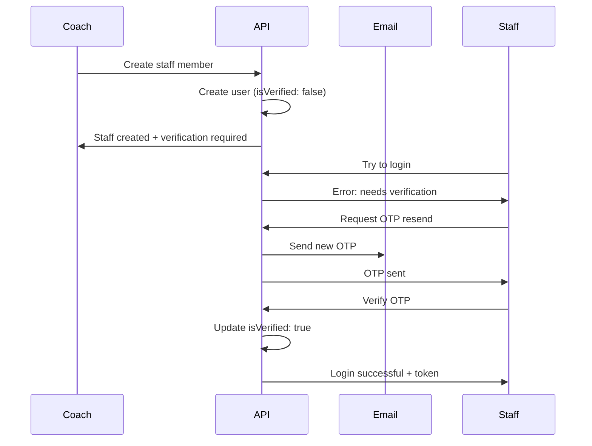
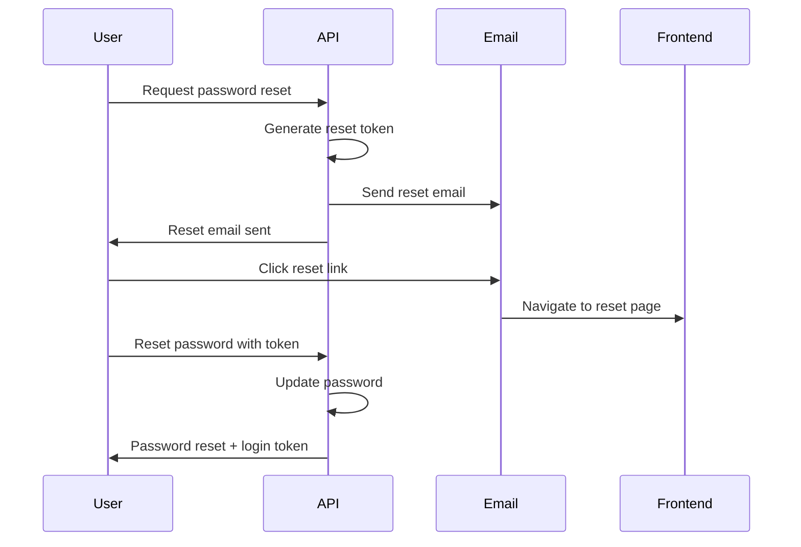

# 🔐 Authentication Flow Examples

## 📋 Overview

This document provides comprehensive examples of all authentication flows in the FunnelsEye system, including:
- User Registration & Email Verification
- Login & Session Management
- Forgot Password & Reset
- New Member Verification (Staff & MLM Downline)
- OTP Management

## 🚀 **1. User Registration & Email Verification Flow**

### 1.1 User Signup
```javascript
POST /api/auth/signup
{
  "name": "John Doe",
  "email": "john@example.com",
  "password": "SecurePass123!",
  "role": "coach"
}

// Response:
{
  "success": true,
  "message": "User registered successfully. An OTP has been sent to your email for verification.",
  "userId": "user_123",
  "email": "john@example.com",
  "role": "coach"
}
```

### 1.2 Email Verification with OTP
```javascript
POST /api/auth/verify-otp
{
  "email": "john@example.com",
  "otp": "123456"
}

// Response:
{
  "success": true,
  "token": "eyJhbGciOiJIUzI1NiIsInR5cCI6IkpXVCJ9...",
  "user": {
    "id": "user_123",
    "name": "John Doe",
    "email": "john@example.com",
    "role": "coach",
    "isVerified": true
  }
}
```

## 🔑 **2. Login Flow**

### 2.1 Successful Login
```javascript
POST /api/auth/login
{
  "email": "john@example.com",
  "password": "SecurePass123!"
}

// Response:
{
  "success": true,
  "token": "eyJhbGciOiJIUzI1NiIsInR5cCI6IkpXVCJ9...",
  "user": {
    "id": "user_123",
    "name": "John Doe",
    "email": "john@example.com",
    "role": "coach",
    "isVerified": true
  }
}
```

### 2.2 Login with Unverified Account
```javascript
POST /api/auth/login
{
  "email": "unverified@example.com",
  "password": "password123"
}

// Response:
{
  "success": false,
  "message": "Please verify your email first. Use the resend OTP endpoint to get a new verification code.",
  "needsVerification": true,
  "email": "unverified@example.com"
}
```

## 🔒 **3. Forgot Password Flow**

### 3.1 Request Password Reset
```javascript
POST /api/auth/forgot-password
{
  "email": "john@example.com"
}

// Response:
{
  "success": true,
  "message": "Password reset email sent successfully."
}

// Email sent with reset link:
// http://localhost:5000/reset-password?token=abc123...
```

### 3.2 Reset Password with Token
```javascript
POST /api/auth/reset-password
{
  "token": "abc123...",
  "password": "NewSecurePass456!"
}

// Response:
{
  "success": true,
  "token": "eyJhbGciOiJIUzI1NiIsInR5cCI6IkpXVCJ9...",
  "user": {
    "id": "user_123",
    "name": "John Doe",
    "email": "john@example.com",
    "role": "coach",
    "isVerified": true
  }
}
```

## 📧 **4. OTP Management**

### 4.1 Resend Verification OTP
```javascript
POST /api/auth/resend-otp
{
  "email": "john@example.com"
}

// Response:
{
  "success": true,
  "message": "New OTP sent successfully to your email."
}
```

## 👥 **5. New Member Creation & Verification Flow**

**🔄 Updated Flow (2024):** New staff and MLM downline members no longer receive verification OTPs immediately upon creation. Instead, verification is deferred until their first login attempt. This prevents OTP expiration and provides a better user experience.

**How it works:**
1. Coach creates new member → Account created with `isVerified: false`
2. New member attempts to login → Receives `needsVerification: true` response
3. Member requests OTP via `/api/auth/resend-otp` → OTP sent to email
4. Member verifies OTP → Account becomes verified and login succeeds

### 5.1 Coach Creates Staff Member
```javascript
POST /api/staff
Authorization: Bearer <coach_token>
{
  "name": "Sarah Johnson",
  "email": "sarah@coachvarun.com",
  "password": "StaffPass123!",
  "permissions": ["leads:read", "leads:update"]
}

// Response:
{
  "success": true,
  "message": "Staff member created successfully. Email verification required on first login.",
  "data": {
    "_id": "staff_456",
    "name": "Sarah Johnson",
    "email": "sarah@coachvarun.com",
    "role": "staff",
    "coachId": "coach_123",
    "permissions": ["leads:read", "leads:update"],
    "isVerified": false,
    "isActive": true
  }
}

// Email verification required on first login
```

### 5.2 Staff Member Verifies Email
```javascript
POST /api/auth/verify-otp
{
  "email": "sarah@coachvarun.com",
  "otp": "789012"
}

// Response:
{
  "success": true,
  "token": "eyJhbGciOiJIUzI1NiIsInR5cCI6IkpXVCJ9...",
  "user": {
    "id": "staff_456",
    "name": "Sarah Johnson",
    "email": "sarah@coachvarun.com",
    "role": "staff",
    "isVerified": true
  }
}
```

### 5.3 Coach Creates MLM Downline Member
```javascript
POST /api/mlm/downline
Authorization: Bearer <coach_token>
{
  "name": "Mike Wilson",
  "email": "mike@coachvarun.com",
  "password": "DownlinePass123!",
  "sponsorId": "coach_123"
}

// Response:
{
  "success": true,
  "message": "Coach successfully added to downline! Email verification required on first login.",
  "data": {
    "coachId": "coach_789",
    "sponsorId": "coach_123",
    "name": "Mike Wilson",
    "email": "mike@coachvarun.com"
  }
}

// Email verification required on first login
```

### 5.4 Downline Member Verifies Email
```javascript
POST /api/auth/verify-otp
{
  "email": "mike@coachvarun.com",
  "otp": "345678"
}

// Response:
{
  "success": true,
  "token": "eyJhbGciOiJIUzI1NiIsInR5cCI6IkpXVCJ9...",
  "user": {
    "id": "coach_789",
    "name": "Mike Wilson",
    "email": "mike@coachvarun.com",
    "role": "coach",
    "isVerified": true
  }
}
```

## 🔄 **6. Complete Flow Examples**

### 6.1 New Staff Member Complete Journey (Updated Flow)
**Important Note:** New staff and MLM downline members no longer receive verification OTPs immediately upon creation. Verification is deferred until their first login attempt.

**Flow:**
1. Coach creates new member → Account created with `isVerified: false`
2. New member attempts to login → Receives `needsVerification: true` response
3. Member requests OTP via `/api/auth/resend-otp` → OTP sent to email
4. Member verifies OTP → Account becomes verified and login succeeds

**Benefits of this approach:**
- Prevents OTP expiration if member doesn't login immediately
- Reduces unnecessary email sending
- Verification happens when member is actually ready to use the system
- Better user experience for delayed logins


### 6.2 Forgot Password Complete Journey


## ⚠️ **7. Error Handling Examples**

### 7.1 Invalid OTP
```javascript
POST /api/auth/verify-otp
{
  "email": "john@example.com",
  "otp": "000000"
}

// Response:
{
  "success": false,
  "message": "Invalid or expired OTP."
}
```

### 7.2 Expired Reset Token
```javascript
POST /api/auth/reset-password
{
  "token": "expired_token",
  "password": "NewPass123!"
}

// Response:
{
  "success": false,
  "message": "Invalid or expired reset token."
}
```

### 7.3 Email Already Exists
```javascript
POST /api/auth/signup
{
  "name": "John Doe",
  "email": "john@example.com",
  "password": "Pass123!",
  "role": "coach"
}

// Response:
{
  "success": true,
  "message": "User already exists but is not verified. A new OTP has been sent to your email."
}
```

## 🔧 **8. Security Features**

### 8.1 Password Requirements
- Minimum 8 characters
- Must contain uppercase, lowercase, number, and special character
- Stored as bcrypt hash

### 8.2 Token Security
- JWT tokens with configurable expiration
- Password reset tokens expire in 10 minutes
- OTP tokens expire in 5 minutes

### 8.3 Rate Limiting
- OTP requests limited to prevent abuse
- Password reset requests limited per email
- Login attempts tracked for security

## 📱 **9. Frontend Integration Examples**

### 9.1 Handle Unverified User Login
```javascript
// Frontend login handler
const handleLogin = async (credentials) => {
  try {
    const response = await login(credentials);
    
    if (response.success) {
      // User logged in successfully
      setUser(response.user);
      navigate('/dashboard');
    }
  } catch (error) {
    if (error.response?.data?.needsVerification) {
      // Show verification prompt
      setShowVerification(true);
      setUnverifiedEmail(error.response.data.email);
    } else {
      // Show other error
      setError(error.response?.data?.message || 'Login failed');
    }
  }
};
```

### 9.2 Password Reset Flow
```javascript
// Frontend password reset handler
const handlePasswordReset = async (email) => {
  try {
    await forgotPassword(email);
    setMessage('Password reset email sent! Check your inbox.');
  } catch (error) {
    setError(error.response?.data?.message || 'Failed to send reset email');
  }
};

const handleResetPassword = async (token, newPassword) => {
  try {
    const response = await resetPassword(token, newPassword);
    if (response.success) {
      // User logged in with new password
      setUser(response.user);
      navigate('/dashboard');
    }
  } catch (error) {
    setError(error.response?.data?.message || 'Password reset failed');
  }
};
```

## 🎯 **10. Best Practices**

### 10.1 For Coaches
- Always verify new staff members receive OTP emails
- Monitor staff verification status
- Provide clear instructions to new members

### 10.2 For Users
- Check spam folder for verification emails
- Use strong, unique passwords
- Verify email immediately after registration

### 10.3 For Developers
- Implement proper error handling
- Use environment variables for email configuration
- Monitor email delivery success rates
- Implement proper logging for security events

## 📊 **11. Monitoring & Analytics**

### 11.1 Key Metrics to Track
- Email verification success rates
- Password reset completion rates
- Failed login attempts
- OTP delivery success rates

### 11.2 Security Alerts
- Multiple failed login attempts
- Suspicious password reset requests
- Unusual OTP request patterns

This comprehensive authentication system ensures secure user management while providing a smooth user experience for all types of members in the FunnelsEye platform.
